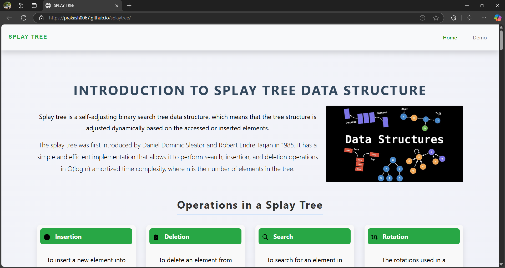
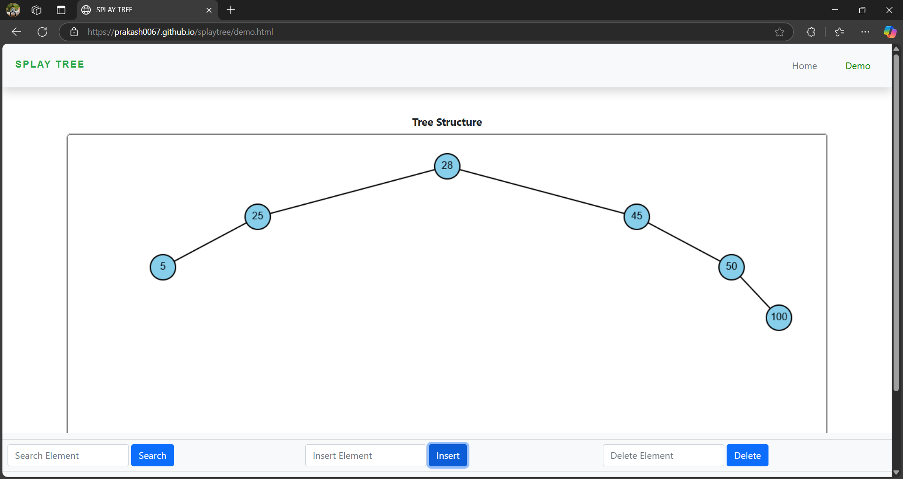

# Splay Tree Visualizer

An interactive web application to visualize **Splay Trees**, built using **HTML**, **CSS**, and **JavaScript**. This tool helps users understand how splay trees work by performing insert, delete, and search operations on a dynamically rendered tree.

## Features

- **Home Page**  
  - Introduction to Splay Trees  
  - Applications, Advantages & Disadvantages  
  - Explanation of Splay Tree rotations  
  - Embedded JavaScript code for reference

- **Demo Page**  
  - User can perform `Insert`, `Delete`, and `Search` operations  
  - Tree visualization is dynamically updated using the `<canvas>` tag  
  - Real-time feedback and visualization of splay operations like Zig, Zig-Zag, and Zig-Zig rotations

## Technologies Used

- **HTML5** – for structuring pages  
- **CSS3** – for basic styling  
- **JavaScript** – core logic for tree operations and visualization  
- **Canvas API** – to draw the tree and update it in real-time

## How It Works

1. The user inputs a number in one of the three operation fields (Insert, Delete, Search).
2. The input triggers the corresponding JavaScript function.
3. The tree gets updated based on Splay Tree logic.
4. The updated tree is drawn dynamically on the canvas.

## Rotations Implemented

- **Zig Rotation**
- **Zig-Zig Rotation**
- **Zig-Zag Rotation**

Each of these plays a key role in bringing recently accessed elements to the root.

## Screenshots

### Homepage

### Demo Page

## Getting Started

To run the project locally:
https://github.com/prakash0067/splaytree/
